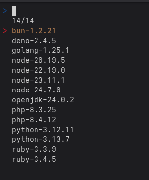

# Aktivace alternativních technologií

Když se připojíte do SSH v aplikaci, můžete aktivovat další podporované technologie k té hlavní, kterou jste vybrali během vytváření aplikace. Slouží k tomu příkaz `activate_tech`.

To se hodí například když máte aplikaci napsanou třeba v Pythonu, ale potřebujete volat build frontend knihoven přes Node.js. Aktivaci provedete takto:

```shell
app@89293e8116ad:~$ activate_tech 
Activating node-20.19.5
Done.
app@89293e8116ad:~$ node --version
v20.19.5
app@89293e8116ad:~$ activate_tech 
Activating php-8.3.25
Done.
app@89293e8116ad:~$ php --version
PHP 8.3.25 (cli) (built: Sep 10 2025 00:21:48) (NTS)
Copyright (c) The PHP Group
Zend Engine v4.3.25, Copyright (c) Zend Technologies
    with Zend OPcache v8.3.25, Copyright (c), by Zend Technologies

```

Po zavolání `activate_tech` se objeví následující nabídka, kde si vyberete jednu z dostupných technologií:



!!! warning "Upozornění"
    Administrace na vybrané technologie nehledí a při změně verze Runtime je potřeba zavolat `activate_tech` znovu a vybrat novou verzi již aktivované technologie.
