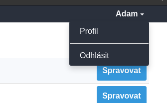
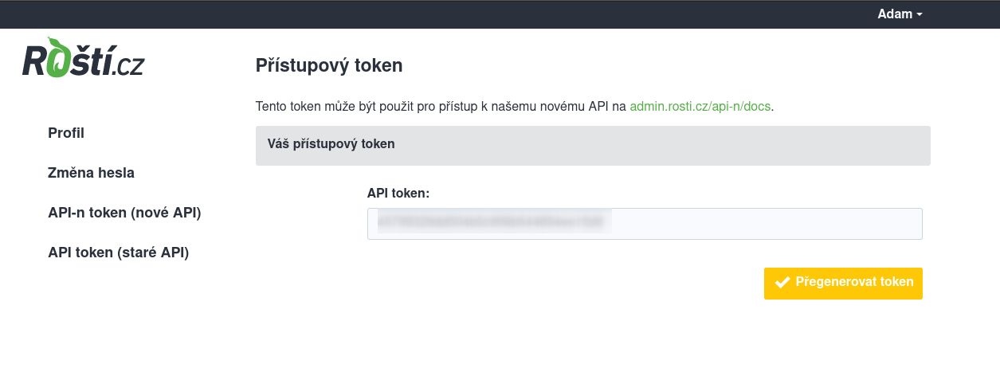

# API

Naše API je možné použít k vytváření, úpravě, zastavení nebo spouštění aplikací z vašich skriptů. To se vám bude hodit například při implementaci AB deploymentu nebo třeba při pravidelném zálohování.

Token pro přístup do API je unikátní pro každého uživatele a najdete ho v administraci v sekci **Nastavení → API token**.

Po otevření sekce **API token** můžete token zkopírovat nebo přegenerovat.

Token je možné kdykoli přegenerovat, ale každý uživatel může mít jen jeden.

Dokumentace k API je oddělená od této dokumentace, protože je generovaná společně se změnami v kódu a najdete ji na adrese [https://admin.rosti.cz/api-n/docs](https://admin.rosti.cz/api-n/docs).

Staré API už není ve vývoji a nové služby do něj nebudeme přidávat.
