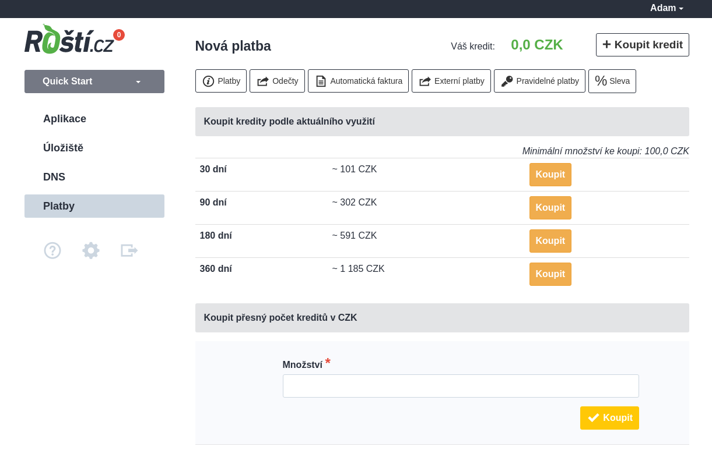

# Platby

Na Roští se platí pouze za běžící aplikace a to za každou započatou hodinu. Můžete tedy Roští využívat jen na občasné testování nějakých změn a zaplatíte jen za čas, po který testovací aplikace běžela. Pokud aplikaci nepotřebujete, je možné ji vypnout a budete platit pouze za obsazený diskový prostor.

V současné době funguje Roští na kreditový systém a kredit je potřeba dobít před tím, než je využit. Po registraci máte nicméně 30 dní na vyzkoušení.

Pro dobití kreditu přejděte do sekce *Platby* v administraci a vyberte časový interval spočítaný podle aktuální spotřeby kreditů nebo zadejte přímo částku, kterou chcete dobít. Minimální dobití je 100 Kč, což odpovídá 200 kreditům.

Po odkliknutí je možné zaplatit přes QR kód, převodem na účet a po rozkliknutí zálohové faktury i kartou. Při vygenerování platby se vytvoří zálohová faktura, která neslouží jako daňový doklad. Ten vám bude zaslán automaticky po připsání částky na náš účet nebo na účet GoPay, která se nám stará o platby kartou.

Pokud hosting neuhradíte, dostanete celkem 4 e-maily. První dva vás budou informovat o nedostatku kreditu, třetí o zamčení účtu a vypnutí aplikací a poslední o smazání aplikací. Pokud ke smazání dojde, ozvěte se nám co nejdříve; obnovu dat negarantujeme a dostupnost záloh se řídí aktuálním zálohovacím cyklem uvedeným ve smluvních podmínkách.

V administraci je možné nastavit i automatické generování plateb pod záložkou *Automatická faktura*. Pokud ji zapnete, bude se dobíjet kredit na další nastavitelné období a to v případě, že klesne pod nastavenou hranici. Ta je ve výchozím stavu 50 Kč. Při využití této funkce musí být celkový kredit nad úrovní nastavené hranice. V opačném případě další automatická faktura nebude odeslána.

Dále v sekci platby najdete informace o tom, kolik jsme vám za jednotlivé měsíce odečetli kreditu. Po rozkliknutí měsíce uvidíte detail, za které aplikace, virtuální servery, domény nebo další služby byl kredit odečten.
