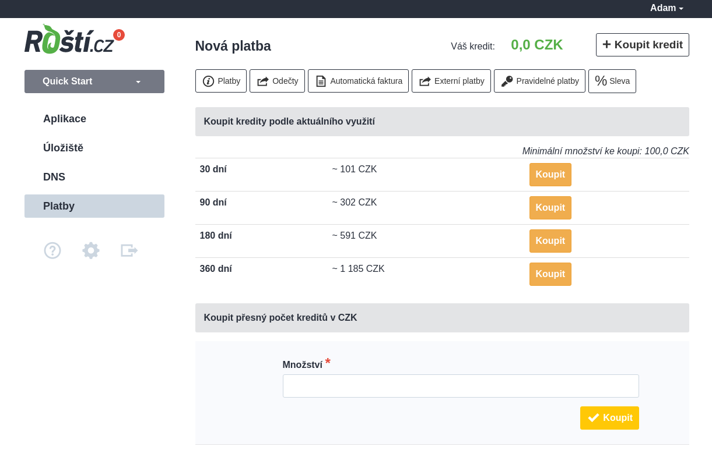

# Platby

## Zkušební období a čerpání kreditu

Po registraci máte 30 dní na vyzkoušení. Během této doby můžete aplikace i jejich balíčky nastavit a používat stejně jako později. Po jejím skončení není nutné přecházet na jiný tarif: u aktivních aplikací se začne podle jejich nastaveného balíčku čerpat kredit.

Roští používá předplacený kreditový systém, proto kredit dobijte před koncem zkušebního období. Systém vás na potřebu dobití upozorní.

Ceny balíčků uvedené za měsíc platí přesně pro 30 dní. U aktivní aplikace se každou hodinu odečte 1/720 ceny jejího balíčku. Za kalendářní měsíc s méně nebo více než 30 dny proto může být celková částka o něco nižší nebo vyšší než uvedená měsíční cena. Výše odpočtu závisí na aktivních aplikacích a jejich balíčcích, nikoli na jejich aktuálním zatížení.

Platí se za každou samostatnou aktivní aplikaci nebo stack. Balíček není společná kvóta pro všechny projekty ve firmě: dvě aplikace se stejným balíčkem se účtují dvakrát. Více projektů či domén můžete provozovat v jedné aplikaci, pokud se vejdou do jejích prostředků; postup popisuje [dokumentace pro více služeb v jedné aplikaci](multidomains.md).

Balíček aplikace můžete v jejích parametrech změnit kdykoli. Od okamžiku změny se kredit čerpá podle ceny nově zvoleného balíčku.

Pokud aplikaci nepotřebujete, je možné ji vypnout. Přestanete platit za běh aplikace, ale nadále se účtuje obsazený diskový prostor.

## Dobití kreditu

Pro dobití kreditu přejděte do sekce *Platby* v administraci a vyberte časový interval spočítaný podle aktuální spotřeby kreditů nebo zadejte přímo částku, kterou chcete dobít. Minimální dobití je 100 Kč, což odpovídá 200 kreditům.

Po odkliknutí je možné zaplatit přes QR kód, převodem na účet a po rozkliknutí zálohové faktury i kartou. Při vygenerování platby se vytvoří zálohová faktura, která neslouží jako daňový doklad. Ten vám bude zaslán automaticky po připsání částky na náš účet nebo na účet GoPay, která se nám stará o platby kartou.

Pokud kredit nedobijete, dostanete celkem 4 e-maily. První dva vás budou informovat o nedostatku kreditu, třetí o zamčení účtu a vypnutí aplikací a poslední o smazání aplikací. Pokud ke smazání dojde, ozvěte se nám co nejdříve; obnovu dat negarantujeme a dostupnost záloh se řídí aktuálním zálohovacím cyklem uvedeným ve smluvních podmínkách.

V administraci je možné nastavit i automatické generování plateb pod záložkou *Automatická faktura*. Pokud ji zapnete, bude se dobíjet kredit na další nastavitelné období a to v případě, že klesne pod nastavenou hranici. Ta je ve výchozím stavu 50 Kč. Při využití této funkce musí být celkový kredit nad úrovní nastavené hranice. V opačném případě další automatická faktura nebude odeslána.

Dále v sekci platby najdete informace o tom, kolik jsme vám za jednotlivé měsíce odečetli kreditu. Po rozkliknutí měsíce uvidíte detail, za které aplikace, virtuální servery, domény nebo další služby byl kredit odečten.
