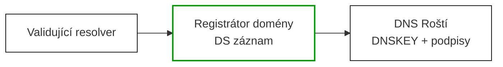

# Aktivace DNSSEC

DNSSEC (Domain Name System Security Extensions) je rozšíření DNS protokolu, které pomocí digitálních podpisů chrání záznamy před podvržením. Díky DNSSEC může klient ověřit, že odpověď DNS serveru je pravá a nebyla cestou změněna.

## Jak DNSSEC funguje

Roští spravuje DNS záznamy vašich domén. Když aktivujete DNSSEC, náš DNS server (BIND) začne automaticky podepisovat všechny záznamy kryptografickými klíči. Veřejná část klíče se publikuje v DNS jako DNSKEY záznam.

Aby validující resolvery (Google, Cloudflare apod.) věděly, že se mají záznamy ověřovat, musí existovat řetěz důvěry od kořenového serveru (`.`) přes registrátora (`.cz`, `.com` apod.) až k vaší zóně. Tento řetěz se vytváří tak, že **DS záznam** (otisk vašeho klíče) zveřejníte u svého registrátora domény.

## Aktivace v administraci

1. Přejděte do administrace Roští → **DNS** → vyberte doménu.
2. V sekci **DNSSEC** klikněte na tlačítko **Zapnout DNSSEC**.
3. Chvíli počkejte — BIND vygeneruje kryptografické klíče (obvykle do minuty).
4. Po načtení stránky se v sekci DNSSEC zobrazí hodnoty pro registrátora. Většina registrátorů používá **DS záznam**, někteří ale požadují hodnoty ze sekce **DNSKEY**.

!!! warning "Důležité pořadí kroků"
    Nejprve aktivujte DNSSEC u nás a počkejte na vygenerování DS záznamů. Teprve pak DS záznamy zadejte u registrátora. Nikdy neodstraňujte DNSSEC v Roští, pokud máte DS záznamy stále aktivní u registrátora — způsobilo by to nedostupnost domény.

## Zadání DS záznamu u registrátora

Každý registrátor má jiné rozhraní, ale postup je vždy podobný — hledejte sekci **DNSSEC** nebo **DS záznamy** v nastavení vaší domény.

Budete potřebovat tyto hodnoty, které najdete v administraci Roští:

| Pole | Popis | Příklad |
|------|-------|---------|
| **Key tag** (klíčový tag) | Číselný identifikátor klíče | `38145` |
| **Algorithm** (algoritmus) | Číslo nebo název algoritmu podepisování | `13` (ECDSA P-256 / SHA-256) |
| **Digest type** (typ otisku) | Typ hashovací funkce | `2` (SHA-256) |
| **Digest** (otisk) | Hexadecimální hash veřejného klíče | `28FE1BC9…` |

### Příklady podle registrátorů

**WEDOS, Forpsi, Master Internet** — v nastavení domény najděte záložku *DNSSEC* nebo *DS záznamy* a vyplňte výše uvedené hodnoty.

**GoDaddy, Namecheap** — hledejte sekci *DNSSEC* v DNS managementu domény.

**CZ.NIC (.cz domény)** — DS záznamy se zadávají buď přímo v rozhraní [mojeID](https://www.mojeid.cz) nebo přes registrátora. Registrátoři s podporou DNSSEC pro .cz domény jsou uvedeni na stránkách [CZ.NIC](https://www.nic.cz).

!!! tip
    Pokud registrátor nabízí možnost zadat celý DS záznam jako jeden řetězec, použijte hodnotu ze sloupce *Raw DS record* v administraci Roști — je ve standardním formátu RFC 4034.

## Zadání DNSKEY u registrátora

Pokud rozhraní registrátora nepožaduje DS záznam, ale DNSKEY, použijte hodnoty ze sekce **DNSKEY** v administraci Roští:

| Pole | Popis | Příklad |
|------|-------|---------|
| **Key** (klíč) | Veřejný klíč DNSKEY bez názvu domény a bez textu `DNSKEY` | `AwEAA...` |
| **Algorithm** (algoritmus) | Číslo algoritmu DNSKEY | `13` (ECDSA P-256 / SHA-256) |
| **Flags** (příznaky) | Příznaky klíče | `257` |
| **Protocol** (protokol) | Protokol DNSKEY | `3` |

Použijte přesně ten formát, který registrátor požaduje. Pokud chce **Key tag**, **Digest type** nebo **Digest**, vyplňte DS záznam. Pokud chce **Key**, **Algorithm**, **Flags** a **Protocol**, vyplňte DNSKEY.

## Ověření funkčnosti

Po zadání DS záznamu u registrátora může trvat až 24–48 hodin, než se změna rozšíří (DNS TTL). Funkčnost DNSSEC lze ověřit pomocí:

- **[dnssec-debugger.verisignlabs.com](https://dnssec-debugger.verisignlabs.com)** — přehledná vizualizace řetězu důvěry
- **[dnsviz.net](https://dnsviz.net)** — podrobná analýza DNSSEC konfigurace
- Příkaz v terminálu: `dig +dnssec +short SOA vasedoména.cz`

Správně nakonfigurovaný DNSSEC vrátí vedle SOA záznamu také RRSIG záznam s digitálním podpisem.

## Vypnutí DNSSEC

Pokud chcete DNSSEC deaktivovat:

1. Nejprve **odstraňte DS záznamy u registrátora** a počkejte na vypršení TTL (obvykle 24–48 hodin).
2. Teprve poté klikněte na **Vypnout DNSSEC** v administraci Roști.

Přeskočení prvního kroku způsobí, že validující resolvery budou stále ověřovat podpisy, nenajdou klíče a doména bude pro uživatele nedostupná.
