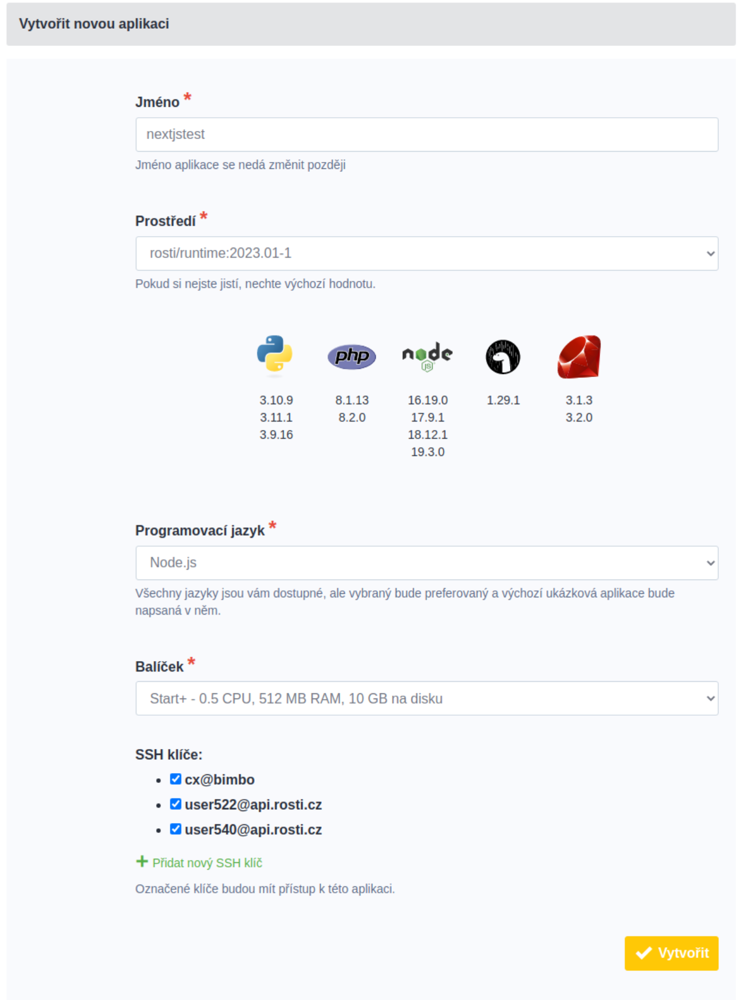

# Instalace Next.js aplikace

## Co budeme potřebovat

Než začneme, musíme si připravit několik věcí:

* Účet v Roští administraci
* Nainstalovaný terminál (třeba [tabby](https://tabby.sh/))
* Lokálně fungující Next.js projekt
* Nainstalovaný rsync a ssh

## Instalace na Roští

Začneme v administraci, kde vytvoříme aplikaci a vybereme Node.js.

Po vytvoření nastavíme heslo a klikneme na tlačítko *Info*, kde najdeme příkaz pro připojení k aplikaci přes SSH. To může být třeba toto:

    ssh app@ssh.rosti.cz -p 26142

Kde port bude pro vaši aplikaci jiný.

Po připojení napíšeme:

    rosti

Vybereme *tech* a pak verzi Node.js, se kterou je náš projekt kompatibilní.

Než se odpojíme, tak ještě půjdeme do souboru */srv/conf/nginx.d/app.conf* a změníme port 8080 na 3000 a restartujeme nginx.

    nano /srv/conf/nginx.d/app.conf
    # po změně :8080 na :3000 ukončíme editaci a uložíme soubor pomocí CTRL+X.
    supervisorctl restart nginx

Z SSH se můžeme odpojit.

Teď je potřeba nakopírovat soubory našeho projektu do */srv/app*. Půjdeme tedy do adresáře s projektem a spustíme:

    npm run build
    # Na následujícím řádku nezapomeneme místo *[PORT]* uvést port, který jsme našli v administraci.
    rsync -av -e "ssh -p [PORT]" --delete --exclude .git/ --exclude .history/ ./ app@ssh.rosti.cz:/srv/app/

Nakonec přes SSH restartujeme Node.js proces:

    ssh -p [PORT] app@ssh.rosti.cz supervisorctl restart app

A máme hotovo.

Při změně stačí pouze zavolat znovu rsync a restartovat Node.js.

## Rychlý deployment pomocí Makefile

Deployment si můžeme usnadnit pomocí nástroje *make*. Ten je součástí většiny linuxových distribucí a Homebrew v OS X jako balíček *make*. Pokud ve svém projektu vytvoříme soubor *Makefile* s tímto obsahem:

    .PHONY: build deploy

    # SSH port z administrace
    PORT=[PORT]

    build:
        npm run build

    deploy: build
        rsync -av -e "ssh -p ${PORT}" --delete --exclude .git/ --exclude .history/ ./ app@ssh.rosti.cz:/srv/app/
        ssh -p ${PORT} app@ssh.rosti.cz supervisorctl restart app

A samozřejmě změníme port na čtvrtém řádku, tak další deployment můžeme provést pouhým spuštěním:

    make deploy
