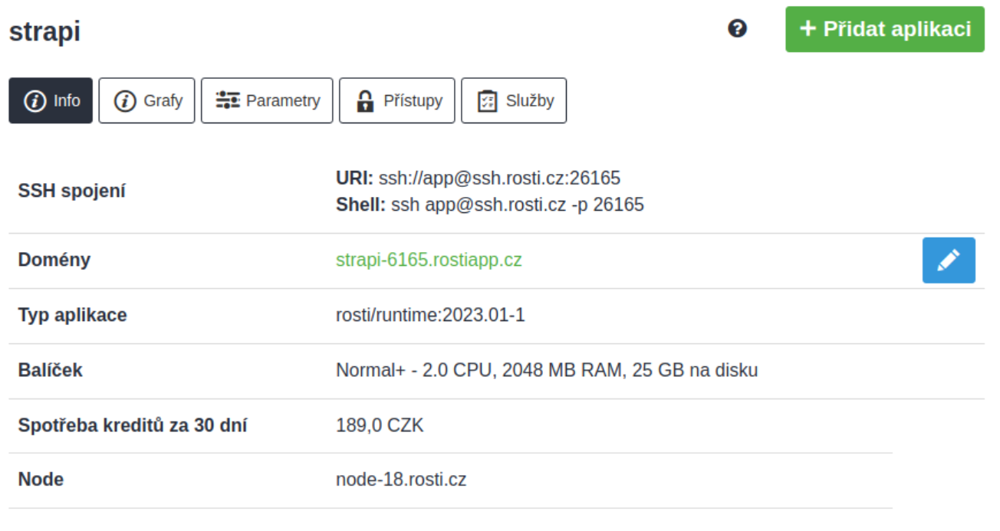
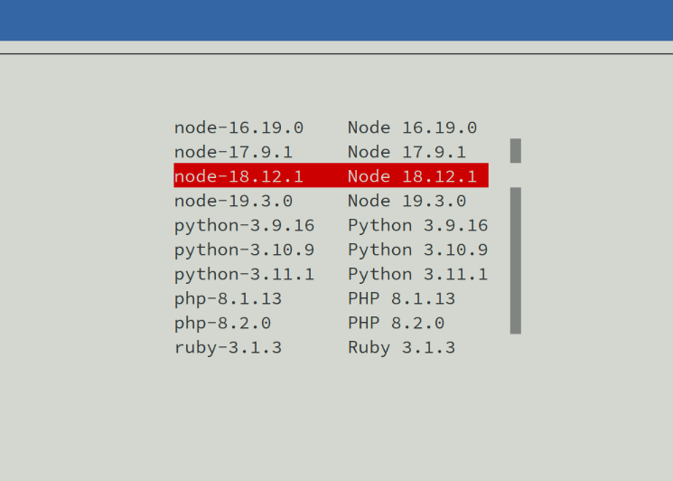
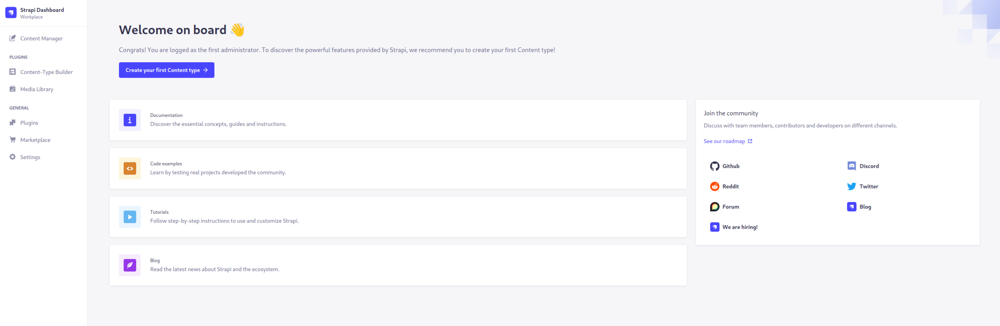

# Instalace Strapi

Co budeme potřebovat:

* Účet v Roští administraci
* Nainstalovaný terminál (třeba [tabby](https://tabby.sh/))

Tento návod byl testován na Runtime *2023.01-1*, je ale pravděpodobně, že poběží i na novějších verzích.

## Postup instalace

Prvním krokem je vytvoření aplikace v administraci, kde Strapi poběží:

Vybereme větší balíček, alespoň *Normal+*, protože instalační proces i Strapi samotné má relativně vysoké nároky na paměť.

Hned po vytvoření aplikace nastavíme heslo pro přístup na SSH a přejdeme do info karty, kde jsou uvedeny přístupy na SSH.

Z info karty si také poznamenáme doménu, kterou nám administrace přidělila.

*Pokud plánujete Strapi používat na produkční data, přejděte zde rovnou do karty Parametry a zapněte HTTPS.*

Máme-li, můžeme se připojit na SSH například přes [tabby](https://tabby.sh/) nebo jiného SSH klienta.

Po přihlášení vybereme Node.js verzi, kterou podporuje současná verze Strapi. V našem případě to je *Node.js 18* a na výběr požijeme příkaz *rosti*:

    rosti
    # Přejdeme do techs a vybereme verzi Node.js

Vyčistíme adresář */srv/app* a zkontrolujeme, jestli opravdu běžíme na správné verzi Node.js:

    cd ~/app && rm *
    node -v

Teď aktualizujeme *yarn* a vytvoříme Strapi projekt:

    npm install -g yarn
    yarn create strapi-app my-strapi --quickstart

Přepínač "--quickstart" řekne instalátoru, aby Strapi používalo SQLite jako úložiště. Pokud ho vynecháte, můžete během instalace [nastavit jednu z podporovaných databází](https://docs.strapi.io/developer-docs/latest/setup-deployment-guides/installation/cli.html#creating-a-strapi-project).

Na konci instalace se Strapi spustí, ale nemáme se na něj jak dostat, takže ho vypneme pomocí *CTRL + C*.

Přejdeme do souboru */srv/conf/supervisor.d/node.conf* a řádek začínající *directory=* změníme na:

    directory=/srv/app/my-strapi

Kromě této změny ještě musíme nastavit doménu, na které Strapi poběží. Jednu pro nás vygenerovala administrace pod doménou *rostiapp.cz* a najdeme ji v administraci v info kartě. Přejdeme do souboru */srv/app/my-strapi/config/server.js* a přidáme tam parametr *url* podobně jako tady:

    module.exports = ({ env }) => ({
        host: env('HOST', '0.0.0.0'),
        port: env.int('PORT', 1337),
        url: "https://strapi-6165.rostiapp.cz", # <---- TADY
        app: {
            keys: env.array('APP_KEYS'),
        },
    });

Doménu sem musíme napsat, protože na Roští běží aplikace za reverzní proxy a Strapi potřebuje vědět, na jaké externí doméně běží, aby mohl svůj frontend připojit k backendu.

Aby se změna ve Strapi projevila musíme ještě zavolat *yarn build*:

    cd /srv/app/my-strapi/
    yarn build

Teď načteme novou konfiguraci a necháme *supervisord* restartovat procesy, kterých se změna týká:

    supervisorctl reread
    supervisorctl update

Když si vypíšeme obsah standardního výstupu Strapi:

    cat /srv/log/node.log

Zjistíme, že běží na portu *1337*, na který musíme nasměrovat Nginx. To uděláme v souboru */srv/conf/nginx.d/app.conf*. Řádek začínající na *proxy_pass* upravíme tak, aby celý soubor vypadal takto:

    server {
        listen       0.0.0.0:8000;
        listen       [::]:8000;
        location / {
                proxy_pass         http://127.0.0.1:1337/;
                proxy_redirect     default;
                proxy_set_header   X-Real-IP  $remote_addr;
                proxy_set_header   Host       $host;
        }
    }

Nakonec restartujeme Nginx:

    supervisorctl restart nginx

A na doméně, kterou administrace přidělila vaší aplikaci na začátku tohoto návodu se dostanete na svou novou instalaci Strapi.

## Poznámky na konec

* Více informací k instalaci se dozvíte v oficiální [Strapi dokumentaci](https://docs.strapi.io/developer-docs/latest/setup-deployment-guides/installation/cli.html#preparing-the-installation).
* Strapi vyžaduje spoustu paměti, takže pokud se chová nestabilně, zvedněte balíček v administraci.
* **Než vytvoříte prvního uživatele, nezapomeňte v administraci zapnout HTTPS.**
* Řetězec *my-strapi* v tomto návodu můžete vyměnit za vlastní název instance.
