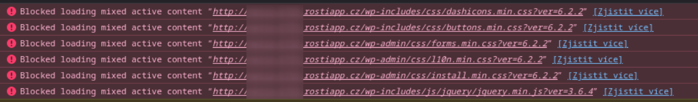

# Instalace WordPressu

WordPress na Roští funguje bez problémů, ale je potřeba mu na začátku během instalace trochu pomoci.
Ve výchozím stavu totiž ignoruje hlavičku *X-Forwarded-Proto*, kde aplikacím říkáme, že běží na
HTTPS. WordPress pak dává do stránek linky na statická data s *http://* místo *https://* a prohlížeče
takové zdroje odmítají načíst. V konzoli prohlížeče pak můžete najít podobný výstup:

Řešením je do *wp-config.php* přidat řádek:

    $_SERVER['HTTPS']='on';

Kromě této změny ještě můžete zvážit optimalizaci počtu PHP-FPM workerů, kterou máme popsanou v
[sekci PHP](../apps/php.md#nastaveni-php-fpm).

S každým běžícím workerem bude růst množství obsazené paměti, takže konečné číslo závisí jak
na vybraném balíčku, tak na množství paměti, které WordPress využije.
