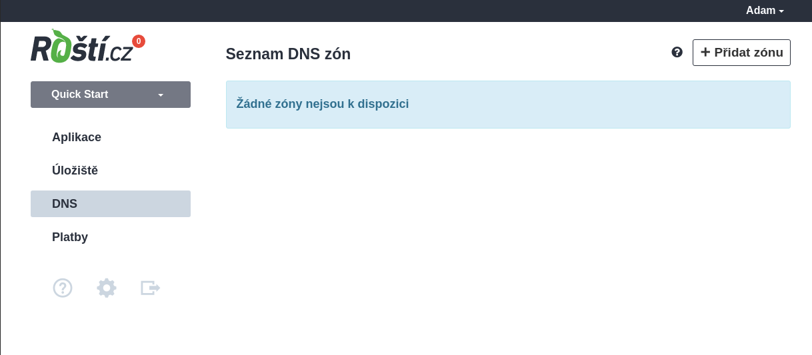
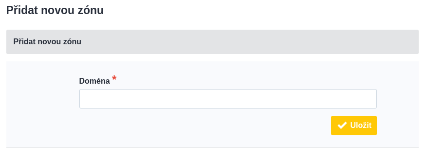
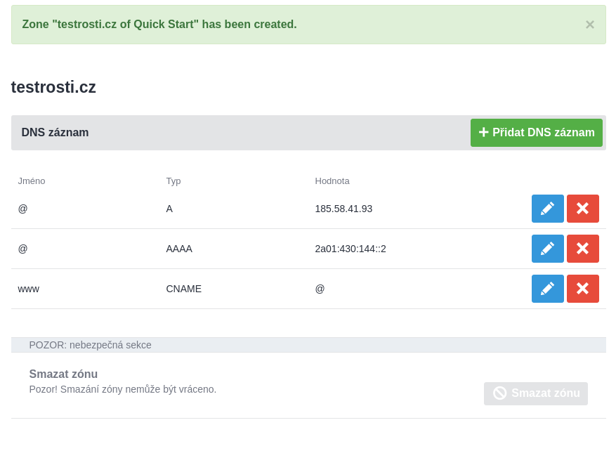
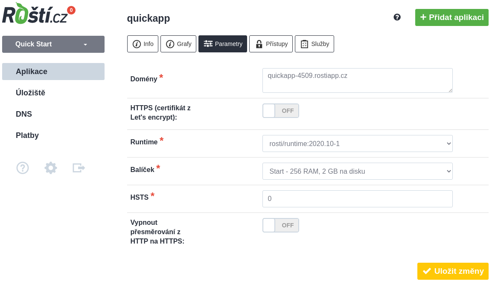

# 4. Domény

Roští umí hostovat DNS zóny pro vaše domény, což je preferovaný způsob, jak k nám domény nasměrovat. Novou doménu můžete zkusit registrovat přímo v administraci v sekci **DNS → Registrovat doménu**. Formulář ukazuje aktuálně podporované doménové koncovky, například `.cz`. Administrace při registraci vytvoří DNS zónu, zapne DNSSEC, předá klíče registrátorovi a doménu zaplatí z kreditu firmy. Pokud DNSSEC klíče ještě nejsou připravené, registrace se neodešle a platba se nestrhne. Stále si ale můžete vybrat i vlastního registrátora, třeba takového, který má domény nebo služby, které jinde dostupné nejsou.

## Nasměrování NS záznamů domény na naše DNS servery

Než začneme, tak přejdeme do administrace, do sekce **DNS** a klikneme na **Přidat zónu bez registrace domény**. Tím řekneme NS serverům na Roští, že mají odpovídat na požadavky na záznamy k této doméně.

Klikneme na tlačítko *Přidat zónu bez registrace domény*.

Vyplníme název naší domény bez www.

Zóna je připravená pro hosting na Roští, takže pokud u nás budete mít na této doméně jen webovou aplikaci, nemusíte nic dalšího řešit a můžete přejít k samotné registraci domény. Případně můžete DNS záznamy upravit jak potřebujete. Například přidat MX a TXT záznamy pro email nebo další A, AAAA či CNAME záznamy webové aplikace.

Nyní můžeme přejít k registraci domény u vybraného registrátora. Při registraci domény se vyplňují NS servery. Každý registrátor to má implementované trochu jinak a ve výchozím stavu budou použity jeho NS servery. Je tedy nutné je změnit na NS servery Roští.cz a to konkrétně na:

* ns1.rosti.cz
* ns2.rosti.cz

U registrace CZ domény je možné použít místo NS serverů tzv. *NSSET*, který je pro Roští *ROSTICZ*, čímž se vyhnete opisování adres výše.

Po zaplacení domény by měla být doména spravovaná našimi NS servery a ve výchozím nastavení na nich bude fungovat *domena.cz* a *www.domena.cz*, kde *domena.cz* nahraďte za jméno registrované domény.

Posledním krokem je nasměrování této nové domény do aplikace vytvořené v předchozích částech. Je to krok společný pro možnost nastavení A/AAAA záznamů a tak přeskočte trochu níže na *Nasměrování domény na aplikaci*.

## Nastavení A/AAAA záznamů u domény s DNS zónou mimo Roští.cz

Je možné, že k nám nechcete dávat zónu vaší domény a proto můžete nasměrovat doménu a její subdomény ručně přímo na náš load balancer. Jeho adresy jsou:

| Typ záznamu | IP adresa            |
|-------------|----------------------|
| A           | 185.58.41.93         |
| AAAA        | 2a01:430:144::2      |

Po nastavení DNS záznamů stačí přejít do parametrů aplikace a přidělit doménu či domény ke konkrétní aplikaci, což je popsané v další sekci.

## Nasměrování domény na aplikaci

Aby byla doména nasměrovaná do konkretní aplikace, musíme ji u aplikace nastavit v administraci, konkrétně v kartě *Parametry*.

Tady doménu a případně její www variantu nebo další subdomény dopíšeme do pole *Domény*. Pole zobrazuje jednotlivé domény jako štítky; doménu potvrdíte mezerou nebo Enterem. Administrace při psaní nabízí volné domény a subdomény z vašich DNS zón. U domén ve zónách spravovaných v Roští umí po potvrzení automaticky vytvořit A a AAAA záznamy na náš load balancer a doménu přiřadit k aplikaci. Domény mimo vaše zóny se přidají jako externě spravované a DNS musíte nastavit u svého poskytovatele. Zelené štítky označují domény v našich DNS zónách, oranžové externě spravované domény. Než změnu potvrdíme, můžeme ještě aktivovat HTTPS, nastavit HSTS nebo změnit balíček.

Je možné, že změny v DNS chvíli potrvají, ale během hodiny by mělo vše fungovat. Doménu, kterou jsme vám dali na testování, můžete používat dál nebo ji smazat.

Než se pustíte do zkoumání co všechno dalšího Rošté umí, mrkněte na poslední část tohoto průvodce, která vám ukáže, [jak použít nástroj rostictl](rostictl.md).
