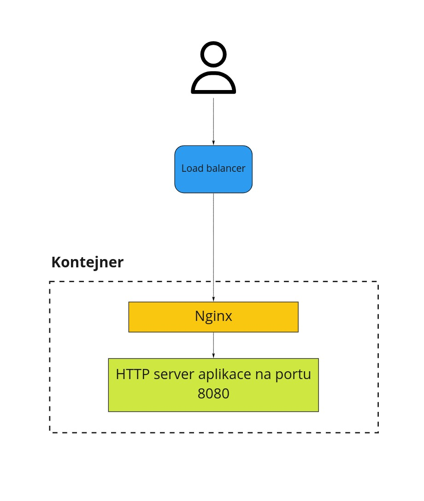
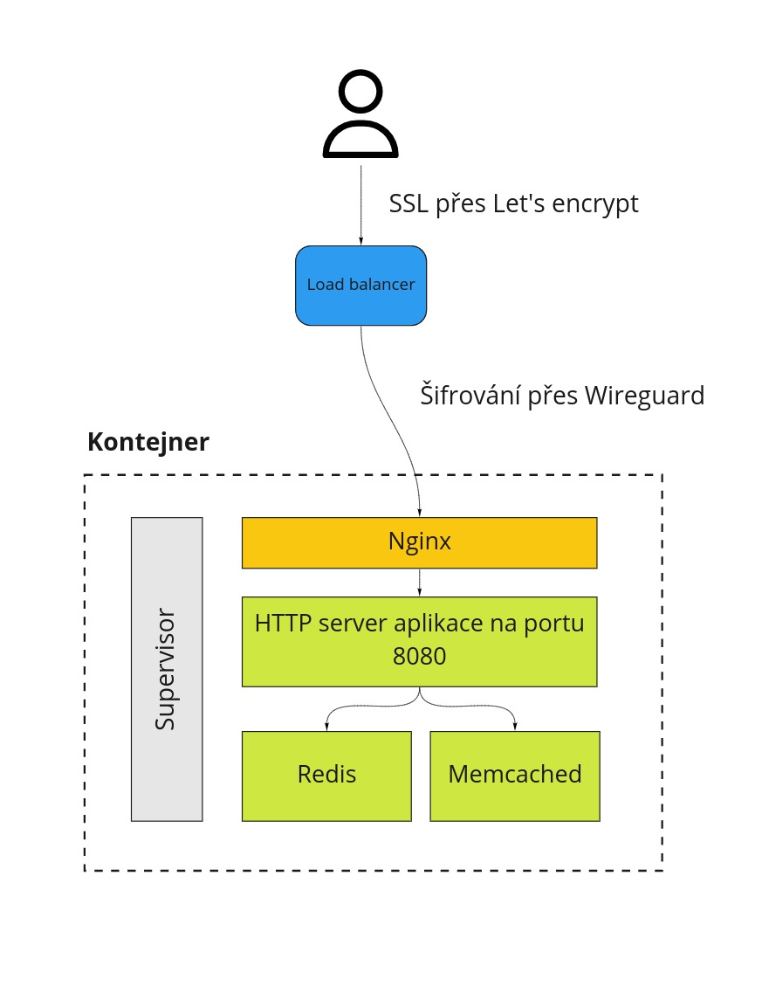

# 2. První deployment

Deployment doslova znamená rozmístění a je to běžně používané slovo pro nasazování kódu do produkčního či testovacího prostředí. V této části vám chceme ukázat, jak váš existující kód nasadit do kontejneru aplikace, který jsme vytvořili v před chvílí. Vzhledem k tomu, že podporujeme celou řadu technologií a každá se nasazuje trochu jinak, je vysvětlení trochu rozvětvené.

Základ je nicméně stejný pro všechny hostované technologie. Začněme obrázkem níže:

Všichni uživatelé a jejich aplikace mají společný load balancer, který běží na adrese, na kterou směrujete vaše domény. O tom budeme mluvit v jedné z dalších částí. Když přijde požadavek na load balancer, ten podle domény vybere správnou aplikaci a přepošle ho na Nginx, který běží v jejím kontejneru. Nginx běží ve výchozím stavu na portu 8000. Základní poučkou tedy je, že v kontejneru bude fungovat cokoli, co si dokáže povídat protokolem HTTP na portu 8000. Ve výchozím stavu je to tedy Nginx.

Pojďme se připojit do aplikace, kterou jsme v minulé části vytvořili:

    ssh -p 24509 app@ssh.rosti.cz

Uživatelské jméno *app* je pro všechny aplikace stejné. Port se ale mění a u vaší aplikace bude obojí jiné. Pro připojení doporučujeme využít SSH klienta v Linuxu či na Mac OS X. Na Windows můžete použít Linux for Windows Subsystem for Linux (WSL) nebo třeba Putty. Nicméně je možné využít libovolného SSH klienta. Přes SSH se připojujete přímo do kontejneru, kde vaše aplikace poběží. Kromě SSH přístupu můžete použít i SCP nebo SFTP na kopírování souborů.

Když se připojíte do kontejneru, co jsme vytvořili v předchozí části, najdete tam ukázkové nastavení, které můžete využít pro nasazení vlastního kódu. S výjimkou PHP je **základní princip předhodit Nginxu, který už v kontejneru je, HTTP server, který poslouchá na portu 8080**. Na ten Nginx ve výchozím nastavení přesměrovává požadavky, které na něj přijdou. PHP je nastavené trochu jinak, protože u něj používáme PHP-FPM a tak komunikace mezi procesem s vaší aplikací nepoužívá HTTP protokol ale variantu na FastCGI protokol.

Pokud potřebujete změnit výchozí chování Nginxu nebo přidat nějaké pravidlo či zpracování statických souborů, můžete tak učinit v adresáři */srv/conf/nginx.d/*. Po jakékoli změně je nutné Nginx restartovat, což si popíšeme podrobněji v další sekci, ale když trochu přeskočím, tak je to:

    supervisorctl restart nginx

## Supervisor

V každém našem kontejneru běží Supervisord, který se stará o procesy, které běží na pozadí. Což může být právě Nginx, proces či procesy související s vaší aplikací a nebo třeba Memcached či Redis, pokud jste si je v administraci přidali. 

Konfiguraci supervisoru najdete v:

    /srv/conf/supervisor.d

Kde je ve výchozím stavu konfigurační soubor pro Nginx a ukázkovou aplikaci. Takhle si zobrazíme jejich status:

    app@quickapp_4509:~$ supervisorctl status
    app                              RUNNING   pid 79, uptime 20:30:33
    nginx                            RUNNING   pid 78, uptime 20:30:33

Oba procesy můžeme i restartovat nebo zastavovat. Můžeme přidat i vlastní proces, stačí když zkopírujeme již existující konfiguraci a upravíme ji jak potřebujeme.

Pokud cokoli změníme v Supervisoru, je nutné zavolat dva příkazy, aby se nová konfigurace načetla:

    app@quickapp_4509:~$ supervisorctl reread
    nginx: changed
    app@quickapp_4509:~$ supervisorctl update
    nginx: stopped
    nginx: updated process group

Příkaz *reread* znovu načte celou konfiguraci a *update* restartuje procesy, kterých se týkají provedené změny. Pokud tedy nasadíte novou verzi vašeho kódu, nemusíte restartovat celý kontejner, ale stačí zavolat:

    app@quickapp_4509:~$ supervisorctl restart app
    app: stopped
    app: started

Supervisor má i interaktivní shell. Příkazy jsou stejné jako v předchozích příkladech a záleží tak spíš na tom, co vám sedí více. Tady je malá ukázka:

    app@quickapp_4509:~$ supervisorctl 
    app                              RUNNING   pid 183, uptime 0:00:19
    nginx                            RUNNING   pid 180, uptime 0:01:45
    supervisor> restart app
    app: stopped
    app: started
    supervisor> stop nginx
    nginx: stopped
    supervisor> status
    app                              RUNNING   pid 187, uptime 0:00:05
    nginx                            STOPPED   Jan 01 08:13 PM

**Při změně konfigurace supervisoru vždy zavolejte *reread* a *update*. V případě překlepu nebo chyby se může stát, že nenajede celý kontejner.**

## Jednotlivé technologie

Pojďme si jednotlivé programovací jazyky projít a řekneme si nejjednodušší cestu, jak nějakou aplikaci v daném jazyku na Roští nasadit. Jak jsme si řekli výše, základní princip je spustit HTTP server na portu 8080, s výjimkou PHP.

Níže jsou popsány specifika deploymentu jednotlivých podporovaných technologií. Pokud vás zajímá jen jedna, můžete ostatní v klidu přeskočit.

### Python

Ukázková aplikace používá [Gunicorn](https://gunicorn.org/), který překládá Pythoní WSGI protokol na HTTP protokol. Je možné ale Gunicorn nahradit HTTP serverem implementovaným v Pythonu. Nasazení vlastního Pythoního kódu může být trochu komplikované, pokud s tím ještě nemáte zkušenosti.

Ideální ukázkou je tady [Django](https://www.djangoproject.com/). Všechny Django projekty mají soubor *wsgi.py*, který má vše, co Gunicorn potřebuje. Můžete si k němu [projít i dokumentaci](https://docs.djangoproject.com/en/3.1/howto/deployment/wsgi/). Pokud je tedy váš projekt napsaný za pomoci Djanga, zkopírujte celý projekt do */srv/app* a nainstalujete jeho závislosti:

    cd /srv/app
    pip install -r requirements.txt

Pak v něm najděte *wsgi.py*. Dejme tomu, že to bude soubor */srv/app/muj_projekt/wsgi.py*. Půjdeme tedy do nastavení supervisoru, konkrétně do *conf/supervisor.d/python.conf* a tam změníme řádek *command=* následovně:

    command=/srv/venv/bin/gunicorn -u app -g app -b 0.0.0.0:8080 --access-logfile - --error-logfile - --reload muj_projekt.wsgi

Proti předchozímu stavu se změnila cesta k *wsgi* modulu, která je adresována stejně jako v Pythoním kódu.

Máme-li hotovo, zavoláme:

    supervisorctl reread
    supervisorctl update

Na doméně, co jste dostali k vaší nové aplikaci, by nyní měl běžet váš vlastní kód. V případě, že narazíte na jiný výstup než jste čekali, mrkněte do logů v */srv/log*, kde na 99 % najdete odpověď na to co je špatně.

V případě, že používáte jiný framework, mrkněte do jeho dokumentace, jakým způsobem se konfiguruje WSGI rozhraní a řiďte se tím.

Nakonec ještě pár poznámek:

* Pythoní aplikace využívají virtualenv, který se nachází v /srv/venv.
* Python není dobrý na servírování statického obsahu, proto před nasazením do produkce otevřete soubor /srv/nginx.d/app.conf a najděte v něm zakomentovanou sekci "location /static/*. Odkomentujte si a nastavte správně cesty, aby statické soubory byly servírovány přímo Nginxem. Zvedne se tím výrazně výkon vaší aplikace.

### PHP

Používáme PHP-FPM jak bylo řečeno výše a ukázková aplikace je normální PHP skript, který najdete v */srv/app*. Pokud chcete nasadit něco jiného, jednoduše obsah tohoto adresáře nahraďte vlastním kódem a bude to fungovat. Roští umožňuje upravit téměř každé nastavení PHP, takže pokud chcete znát detaily, [mrkněte do sekce](../apps/php.md), která se PHP věnuje.

### Node.js

Výchozí aplikace používá build-in HTTP server, který **poslouchá na portu 8080**. Stačí vaši aplikaci upravit, aby také poslouchala na stejném portu, nakopírovat ji do /srv/app a ujistit se, že po zavolání *npm start*, se tento HTTP server spustí. Pravděpodobně má vaše aplikace nějaké závislosti, které je potřeba nainstalovat, než ji poprvé spustíte. Závislosti se instalují stejně jako ve vašem lokálním vývojovém prostředí. Po nakopírování všech souborů do */srv/app* se tedy připojte přes SSH do kontejneru a zavolejte:

    cd /srv/app
    npm install
    supervisorctl restart app

Tím nainstalujete závislosti a restartujete Node.js proces, který by teď měl mít načtený váš kód.

Než smažete ukázkový kód, tak si prohlédněte jak v něm je udělaný *package.json*. Nejsnadnější cesta je do vašeho "package.json" přidat podobnou *scripts* sekci jako je právě tam:

    "scripts": {
        "start": "/srv/bin/primary_tech/node app.js"
    }

Všimněte si také cesty */srv/bin/primary_tech*. Je to adresář, do kterého jsou nalinkované nástroje podle technologie vybrané při vytváření aplikace. Všechny podporované technologie najdete v */opt/techs/* a je možné je používat i najednou, pokud nastavíte cesty přímo do */opt/techs/*.

### Deno

Deno má z pohledu deploymentu hodně společného s Go. Oba jazyky mají integrovány nástroje pro správu závislostí, testování, formátování kódu či linter a výstupem může být u obou jeden binární soubor, i když z principu budou oba vypadat jinak.

Nasazení Deno aplikace je přímočaré. Nakopírujete kód, upravíte nastavení supervisoru a restartujete běžící instanci Dena. Kód tedy nakopírujte do */srv/app* a upravte nastavení Supervisoru v */srv/conf/supervisor.d/deno.conf*. Důležité je změnit cestu k hlavnímu JS nebo TS souboru ve vašem kódu. Po jeho spuštění by měl naběhnout HTTP server na portu 8080 tak jak je vysvětleno výše. Když máte hotovo, zavolejte:

    supervisorctl reread
    supervisorctl update

A na doméně, přidělené vaší aplikaci, by se mělo objevit to co tam očekáváte. Pokud náhodou ne, mrkněte do */srv/log*, kde téměř jistě bude napsané co se stalo. Až to opravíte, zavolejte

    supervisorctl restart app

Aby se běžící Deno proces restartoval a načetli se poslední změny.

### Golang

Stejně jako Deno i Golang je velmi jednoduché nasadit. Vaše Go aplikace by měla poslouchat na portu 8080 a komunikovat protokolem HTTP. Na svém lokálním počítači zkompilujte váš kód pro Linux a architekturu amd64. Vě většině případů bude stačit zavolat:

    go build

Je možné, že na vašem systému bude jiná verze Glibc a výsledná binárka nemusí v kontejneru fungovat. V takovém případě můžete klidně zkopírovat zdrojové kódy přímo do kontejneru a zavolat *go build* odtamtud přes SSH.

Máte-li binárku, nakopírujte ji do */srv/app*. Dejme tomu, že jste ji nakopírovali do */srv/app/moje_app*. Teď přejděte do nastavení supervisoru v souboru */srv/conf/supervisor.d/go.conf* a změňte řádek začínající *command=* tak, aby ukazoval na nakopírovanou binárku. Měl by tedy vypadat nějak takto:

    command=/srv/app/moje_app

Pak zavolejte:

    supervisorctl reread
    supervisorctl update

Tím se načtou změny z konfigurace supervisoru a rovnou se aplikují. Na doméně přidělené vaší aplikaci by měl být výstup této binárky. Pokud tomu tak není, mrkněte do */srv/log*, kde téměř jistě zjistíte, proč aplikace nefunguje.

## Něco málo závěrem

Než přejdeme dál, podíváme se, jak putuje požadavek, který přijde do naší infrastruktury.

Komunikace mezi naším load balancerem a vaší aplikace je šifrována na úrovni síťové vrstvy a HTTPS řeší až load balancer. Veškerá komunikace v naší infrastruktuře, která jde skrze internet, je tedy šifrována.

To bude z této části všechno a můžeme se [přesunout k databázím](databases.md).

