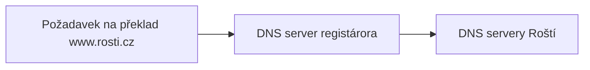

# Nastavení NS záznamů

Když administrace hlásí, že jedna nebo více zón má špatně nastavené NS záznamy, tak to znamená, že doména nemá nastaveny naše NS servery u registrátora konkrétní domény, tedy servery, kam může registrátor směrovat požadavky na záznamy k vaší doméně. Na schématu níže vidíte, že překlad domény probíhá zjednodušeně tak, že se vaše zařízení zeptá registrátora třeba na doménu *www.rosti.cz* a registrátor buď vrátí konkrétní hodnotu a nebo vrátí informaci, že záznamy této domény jsou u nás.

Řešením je jít do rozhraní registrátora domény a nastavit NS servery na naše:

* **ns1.rosti.cz**
* **ns2.rosti.cz**

V případě CZ domén je možné použít NSSET s názvem **ROSTICZ**.
